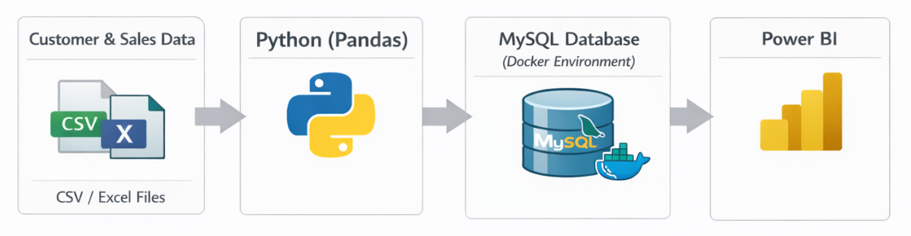
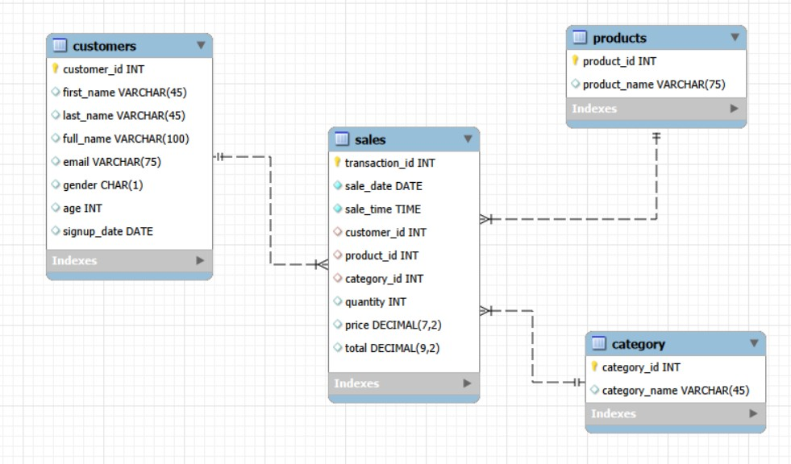

# Project: Retail Sales & Customer Data Pipeline

## Table of Contents
- [Overview](#overview)
- [Project Structure](#Project-structure)
- [Architecture](#architecture)
- [Database Schema](#database-schema)
- [Installation and Setup](#installation-and-setup)
- [ETL Workflow](#etl-workflow)
- [Dashboard Example](#dashboard-example)

### Overview

The Retail Sales ETL is an end-to-end beginner project designed to demonstrate practical skills 
in data ingestion, cleaning, transformation, and loading using industry‑standard tools/technologies. 
The project simulates a retail analytics workflow by processing raw customer & sales data stored in CSV/Excel files, 
transforming it with Python, and loading the data into MySQL, a relational database.

### Project Structure
```text
retailsales/
│
├── data/
│   ├── raw/
│   └── processed/
│
├── scripts/
│   ├── retail_customer_etl.py
│   ├── retail_sales_etl.py
│   └── db-sql/
│   	└── retail-sales_setup.sql
│
├── README.md
├── .env                   # Environment variables (local only)
├── requirements.txt
└── docker-compose.yml
```

### Architecture


### Database Schema


### Installation and Setup
```text
Create project structure
```
```text
Define credentials & parameters in .env 
```
```text
Create Virtual Environment (Optional)
python -m venv venv
source venv/bin/activate  # Windows: venv\Scripts\activate
```
```text
pip install -r requirements.txt
```
```text
Launch Mysql (Docker) container
docker compose up -d
```
```text
Connect to database server
mysql -u root -h xxx.xxx.xxx.xxx -p
```
```text
Create database tables using SQL
source scripts/db-sql/retail-sales_setup.sql
```

### ETL Workflow

**Extract**
- Read CSV file(s)

**Transform**
- Standardize date formats (YYYY-MM-DD).
- Normalize text fields (trim spaces, fix casing, emails, names)
- Remove duplicates
- Handle missing/null values
- Normalize categories, products
- Revise total sale
- Calculate Yearly/Monthly Sales Trend
- Product/Category revenue contribution

**Load**
- Load cleaned data:
    - Customers
	- Products
	- Category
	- Sales

### Dashboard Example

"# RetailSales" 
